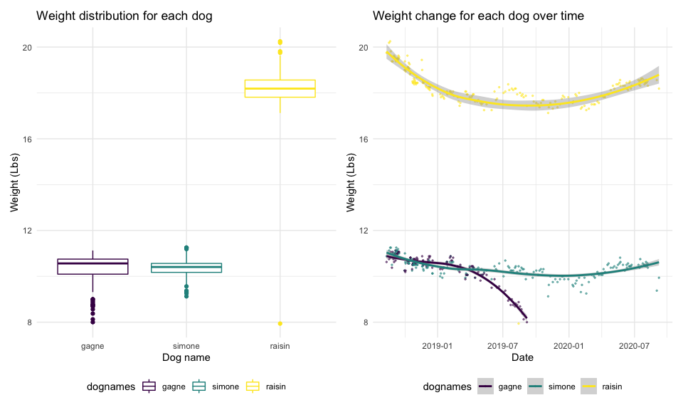

Midterm Project
================
Jiayi Zhou

## Problem 1: Data

**Description on the raw dataset:** The dog weights raw dataset has six
variables. The first column contains the date of each weighing from
August 12nd, 2018 to September 7th, 2020, while some dates in this
period were not recorded. The second to fifth columns contain
information about the weights of three dogs and a standard object:
Raisin, Simon, Gagne, and std. All weights were recorded in the
combination of Lbs and Oz. The last column contains occasional notes. My
goal is to clean and preserve valuable data of the dataset, then report
summarizations and trends.

**First dataframe about dog weights**

``` r
dogweights_df =
  read_excel("./data/dogweights_07sept2020.xlsx", skip = 1) %>% 
  janitor::clean_names() %>%
  mutate(date = as.numeric(date),
         date = janitor::excel_numeric_to_date(date)) %>% 
  select(-x6) %>% 
  pivot_longer(
    raisin:std,
    names_to = "dognames_and_std",
    values_to = "weights"
  ) %>% 
  separate(weights, into = c("Lbs", "Oz"), sep = " ") %>% 
  mutate(
    Lbs = as.numeric(Lbs),
    Oz = as.numeric(Oz),
    weights_in_lbs = Lbs + Oz * 0.0625
    ) %>% 
  drop_na(weights_in_lbs, date) %>% 
  select(-Lbs, -Oz)

dogweights_df
```

    ## # A tibble: 550 x 3
    ##    date       dognames_and_std weights_in_lbs
    ##    <date>     <chr>                     <dbl>
    ##  1 2018-08-12 raisin                     19.8
    ##  2 2018-08-12 simone                     10.9
    ##  3 2018-08-12 gagne                      10.6
    ##  4 2018-08-19 raisin                     20.2
    ##  5 2018-08-19 simone                     11.1
    ##  6 2018-08-19 gagne                      10.8
    ##  7 2018-08-19 std                        21.0
    ##  8 2018-08-22 raisin                     20.2
    ##  9 2018-08-22 simone                     11.2
    ## 10 2018-08-22 gagne                      10.8
    ## # … with 540 more rows

**Descriptions of the steps for tidying:** The observations in “date”
were shown as serial numbers after importation. Thus, I first transfered
“date” to numeric variable, then the excel\_numeric\_to\_date from the
janitor package was used to convert the serial numbers to date class.
Next, I put all dog names and the “std” into the “dognames\_and\_std”
columns using pivot\_longer since they can all be categorized as names.
All weights were organized into “weights\_in\_lbs” columns. To convert
the weight unit, separation of the Lbs and Oz in the same cell was done
first. Then, (weights(Oz)\*0.0625) was added back to weights(Lbs) to get
the whole weight in single unit Lbs.

**About NAs:** I chose to drop NAs in the tidied dataset. After
pivoting, dropping the NAs in weight will only delete the observations
that have no weight recorded for one specific name (dogs or std) on the
specific date. I chose to drop the NAs in “date” too, even though there
is weight information associated with the NAs in “date”. This is because
weight records without date, as well as dates without weight records,
may not be useful for data analysis and plot generation.

**Second dataframe about notes**

``` r
notes_df =
  read_excel("./data/dogweights_07sept2020.xlsx", skip = 1) %>% 
  janitor::clean_names() %>%
  mutate(date = as.numeric(date),
         date = janitor::excel_numeric_to_date(date)) %>% 
  rename(note = x6) %>% 
  select(date, note) %>% 
  drop_na(date, note)

notes_df
```

    ## # A tibble: 14 x 2
    ##    date       note                                                              
    ##    <date>     <chr>                                                             
    ##  1 2018-08-27 Right after leaving for 3 days at Weber's                         
    ##  2 2018-09-04 at camp bow wow                                                   
    ##  3 2018-10-01 dogs at Webers from Sept 18-30                                    
    ##  4 2018-10-09 dogs at Webers from Oct 5-8                                       
    ##  5 2018-10-16 on 10/15 all had hair cuts                                        
    ##  6 2018-10-22 dogs at Webers from Oct 18-22                                     
    ##  7 2018-11-18 dogs at Webers from Nov 10-17                                     
    ##  8 2019-01-08 Simone/Gagne  at Webers from Dec 20-Jan 4, Raisin at PC Dec 20-Ja…
    ##  9 2019-09-06 Gagne died 9/8/2019                                               
    ## 10 2019-11-04 on vacation? Dogs at kennel?                                      
    ## 11 2020-02-03 at Kennel?                                                        
    ## 12 2020-05-23 first haircut in 3-4 months                                       
    ## 13 2020-06-23 in PC June 23-July 10, no wts taken, Raisin with us, Simone in ke…
    ## 14 2020-08-07 in Denver and PC aug 9-aug 31, no wts taken, Raisin with us, Simo…

**Export the two dataframes as CSVs**

``` r
write.csv(dogweights_df, "./data/dogweights.csv")
write.csv(notes_df, "./data/notes.csv")
```

## Problem 2: EDA

**Description of the cleaned dogweights\_df dataset:** The tidy dataset
is a tibble: 3 x 550. The 3 variables are “date”, “dognames\_and\_std”,
and “weights\_in\_lbs”.

**Unique dates:**

``` r
unique_dates=
  dogweights_df %>% 
  distinct(date) %>% 
  nrow()

unique_dates
```

    ## [1] 201

There are 201 unique dates in the tidy dog-weights dataset.

**Table showing the dog names with their associate number of
observation, average weight, and the standard deviation:**

``` r
dogweights_df %>% 
  filter(dognames_and_std %in% c("raisin", "simone", "gagne")) %>% 
  group_by(dognames_and_std) %>%
  rename(dognames = dognames_and_std) %>% 
  summarize(
    number_of_obs = n(),
    average_weight = mean(weights_in_lbs),
    sd_of_weight = sd(weights_in_lbs)
  ) %>% 
   knitr::kable()
```

| dognames | number\_of\_obs | average\_weight | sd\_of\_weight |
| :------- | --------------: | --------------: | -------------: |
| gagne    |             119 |        10.29307 |      0.7080774 |
| raisin   |             199 |        18.22582 |      0.9842631 |
| simone   |             192 |        10.37793 |      0.3840684 |

## Problem 3: Visualization

``` r
library(patchwork)
```

``` r
distribution_of_weight = 
  dogweights_df %>% 
  filter(dognames_and_std %in% c("raisin", "simone", "gagne")) %>% 
  group_by(dognames_and_std) %>% 
  rename(dognames = dognames_and_std) %>% 
  mutate(
    dognames = factor(dognames, levels = c("gagne", "simone", "raisin"))
    ) %>% 
  ggplot(aes(x = dognames, y = weights_in_lbs)) +
  geom_boxplot(aes(color = dognames)) +
  labs(x = "Dog name",
       y = "Weight (Lbs)",
       title = "Weight distribution for each dog")

weight_over_time = 
  dogweights_df %>% 
  filter(dognames_and_std %in% c("raisin", "simone", "gagne")) %>% 
  group_by(dognames_and_std) %>% 
  rename(dognames = dognames_and_std) %>% 
  mutate(
    dognames = factor(dognames, levels = c("gagne", "simone", "raisin"))
    ) %>% 
  ggplot(aes(x = date, y = weights_in_lbs, color = dognames)) +
  geom_point(size = 0.5, alpha = 0.5) +
  geom_smooth() +
  labs(x = "Date",
       y = "Weight (Lbs)",
       title = "Weight change for each dog over time")

distribution_of_weight + weight_over_time
```



**Weight Distribution:** The weight distributions of Gagne is relatively
left-skewed with more lower bound outliers compare to Simone’s normally
distributed weight, while they have similar distribution ranges and
medians around 10. The distribution of Raisin’s weight is close to
normal with several extreme outliers. It also has a much larger median,
around 18, compare to the other two dogs.

**Weight Change:** Raisin’s weight has been on a decreasing trend and
started to increase gradually since October 2019. Simone’s weight did
not vary too much over the three-years period. Gagne’s weight started to
decrease rapidly since April 2019. He died on September 8th, 2019
according to the note.
